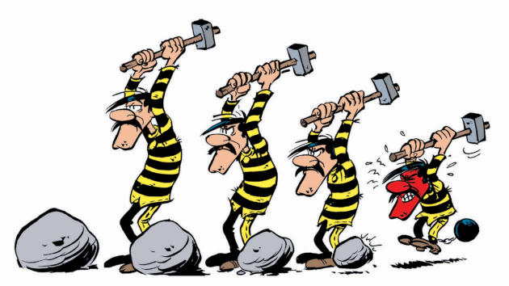

# Promesses

Voici petit document qui devrait vous aider à comprendre le concept de promesses en JavaScript.

Nous utiliserons ici un exemple : la simulation du travail de quatre célèbres bagnards de bande dessinée.



Chaque fonction `breakStones...` ci-dessous représente une manière de casser une pierre.
Ces fonctions sont ensuite utilisées pour distribuer le travail à nos bagnards: casser 25 pierres.

On fait l'hypothèse que chaque pierre donnée à un bagnard et cassée après une minute de travail.
Pour ne pas y passer la nuit, notre programme simule le travail d'une minute en une seconde.

Commençons par nous faire un petit helper qui nous aidera à suivre le déroulement des opérations dans le temps.

```javascript
const log = (text) => console.log(`${new Date().toLocaleTimeString("fr-FR")}: ${text}`);
```

## Approche "classique" avec une simple fonction

Pour casser une pierre de manière active, on frappe la pierre de manière à répétée et aussi rapide que possible

```javascript
function breakStonesActively(person, nbStones) {
  log(`${person} starts breaking ${nbStones} stones...`);
  let nbHits = 0; // keep count of hits
  while (nbStones > 0) {
    const start = Date.now();
    while (Date.now() - start < 1000) { // during one second
      nbHits++; // hit the stone
    }
    nbStones--;
  }
  log(`Finished in ${nbHits} hits`);
}
```

```javascript
// Distribution de 25 pierres
log("\n#####  Méthode classique active #####");
log("---Distribution");
breakStonesActively("Joe", 9);
breakStonesActively("Jack", 5);
breakStonesActively("William", 1);
breakStonesActively("Averell", 10);
log("---Distribution terminée");
```

**Résultat :**
  
> `#####  Méthode classique active #####`  
> `14:34:54: ---Distribution`  
> `14:34:54: Joe starts breaking 9 stones...`  
> `14:35:03: Finished in 166668872 hits`  
> `14:35:03: Jack starts breaking 5 stones...`  
> `14:35:08: Finished in 92304751 hits`  
> `14:35:08: William starts breaking 1 stones...`  
> `14:35:09: Finished in 18685468 hits`  
> `14:35:09: Averell starts breaking 10 stones...`  
> `14:35:19: Finished in 186862839 hits`  
> `14:35:19: ---Distribution terminée`  

## Approche "classique" avec une fonction utilisant un timeout

Cette approche se base sur le fait que les bagnards ont remarqué que les gardiens ne contrôlent jamais le résultat de leur travail.
Ils ont donc pris l'habitude de simplement attendre une minute et affirmer que la pierre était cassée.

```javascript
function breakStonesFaker(person, nbStones) {
  log(`${person} starts faking work on ${nbStones} stones...`);
  let nbHits = 1e5 + Math.floor(1e9 * Math.random()); // make up a lie about the workload
  setTimeout(() => {
    log(`${person} says he finished in ${nbHits} hits`);
  }, 1000 * nbStones); // Wait long enough to make the warden believe the work is done
}
```

```javascript
// Distribution de 25 pierres
log("\n#####  Méthode classique avec timer #####");
log("---Distribution");
breakStonesFaker("Joe", 9);
breakStonesFaker("Jack", 5);
breakStonesFaker("William", 1);
breakStonesFaker("Averell", 10);
log("---Distribution terminée");
```

**Résultat :**

> `#####  Méthode classique avec timer #####`  
> `14:35:27: ---Distribution`  
> `14:35:27: Joe starts faking work on 9 stones...`  
> `14:35:27: Jack starts faking work on 5 stones...`  
> `14:35:27: William starts faking work on 1 stones...`  
> `14:35:27: Averell starts faking work on 10 stones...`  
> `14:35:27: ---Distribution terminée`  
> 
> `14:35:28: William says he finished in 456325735 hits`  
> `14:35:32: Jack says he finished in 95390281 hits`  
> `14:35:36: Joe says he finished in 717695087 hits`  
> `14:35:37: Averell says he finished in 319349062 hits`  

La distribution du travail se fait instantanément parce que la fonction `setTimeout()` ne fait que mettre en place un timer, elle n'attend pas que celui-ci soit arrivé à expiration.

On constate à l'exécution que cette manière de faire semble plus efficace,
parce qu'on obtient la dernière réponse après environ 10 secondes
alors que précédemment il fallait attendre 25 secondes.

Mais cette approche a un gros défaut: une fois que le code a distribué le travail,
il n'a aucun moyen de savoir quand il sera terminé (il ne peut pas lire la console!)

## Promesses

La réponse à ce problème s'appelle "promesse" (`Promise`).

Une promesse est un objet qui représente une valeur qui :
- est disponible maintenant,
- ou le sera plus tard,
- ou ne le sera jamais (en cas d'erreur).

Une promesse peut être dans un seul état à la fois :
1.	**pending** (en attente): L'opération n'est pas encore terminée.
2.	**fulfilled** (tenue): L'opération a réussi → une valeur est disponible.
3.	**rejected** (rejetée): L'opération a échoué → une erreur est disponible.

Une fois fulfilled ou rejected, la promesse est immuable (son état ne change plus).

Quand ils recevront leurs pierres, nos bagnards vont maintenant promettre qu'ils vont les casser.

```javascript
function breakStonesFakePromise(person, nbStones) {
  log(`${person} promises to break ${nbStones} stones...`);
  return new Promise((resolve) => {
    let nbHits = 1e5 + Math.floor(1e9 * Math.random()); // make up a lie about the workload
    setTimeout(() => {
      resolve(`${person} says he kept his promise in ${nbHits} hits`);
    }, nbStones * 1000);
  });
}
```

```javascript
// Distribution de 25 pierres
log("\n#####  Promesses avec timer #####");
log("---Distribution");
breakStonesFakePromise("Joe", 9).then((response) => log(response));
breakStonesFakePromise("Jack", 5).then((response) => log(response));
breakStonesFakePromise("William", 1).then((response) => log(response));
breakStonesFakePromise("Averell", 10).then((response) => log(response));
log("---Distribution terminée");
```

**Résultat :**

> `#####  Promesses avec timer #####`  
> `14:35:46: ---Distribution`  
> `14:35:46: Joe promises to break 9 stones...`  
> `14:35:46: Jack promises to break 5 stones...`  
> `14:35:46: William promises to break 1 stones...`  
> `14:35:46: Averell promises to break 10 stones...`  
> `14:35:46: ---Distribution terminée`  
> 
> `14:35:47: William says he kept his promise in 251324881 hits`  
> `14:35:51: Jack says he kept his promise in 178851005 hits`  
> `14:35:55: Joe says he kept his promise in 375791923 hits`  
> `14:35:56: Averell says he kept his promise in 13082420 hits`  

On voit à l'exécution que le travail s'effectue en parallèle
et donc que l'on n'a à attendre que le temps du travail le plus long (10 secondes).

Mais le gros avantage ici, c'est que le programme appelant reprend le contrôle (à travers `.then`) une fois que le travail est terminé!

Supposons maintenant que nos quatre compères ont affaire un gardien procédurier qui ne veut distribuer qu'un seul travail à la fois
 et attendre qu'il soit terminé avant de distribuer le suivant. (Il est toujours aussi peu regardant sur le résultat du travail effectué.)
Et qu'importe si cela prend beaucoup plus de temps au final.

## `await`

Notre gardien va se servir du mot-clé `await` au moment de la distribution d'un travail:

```javascript
// Distribution de 25 pierres
log("\n#####  Attente de promesses avec timer #####");
log("---Distribution");
await breakStonesFakePromise("Joe", 9).then((response) => log(response));
await breakStonesFakePromise("Jack", 5).then((response) => log(response));
await breakStonesFakePromise("William", 1).then((response) => log(response));
await breakStonesFakePromise("Averell", 10).then((response) => log(response));
log("---Distribution terminée");
```

**Résultat :**

> `#####  Attente de promesses avec timer #####`  
> `14:36:13: ---Distribution`  
> `14:36:13: Joe promises to break 9 stones...`  
> `14:36:22: Joe says he kept his promise in 226840178 hits`  
> `14:36:22: Jack promises to break 5 stones...`  
> `14:36:27: Jack says he kept his promise in 301341690 hits`  
> `14:36:27: William promises to break 1 stones...`  
> `14:36:28: William says he kept his promise in 939133571 hits`  
> `14:36:28: Averell promises to break 10 stones...`  
> `14:36:38: Averell says he kept his promise in 546857485 hits`  
> `14:36:38: ---Distribution terminée`  

Tout ça, c'est très bien, MAIS ! ...

Ce sont des fausses promesses qui sont faites ici, comme le dit le nom de la fonction.
Le bagnard n'effectue aucun travail, il se contentent d'attendre.

Faisons donc une version qui effectue un vrai travail:

```javascript
function breakStonesActivePromise(person, nbStones) {
  log(`${person} promises to actively break ${nbStones} stones...`);
  return new Promise((resolve) => {
    let nbHits = 0; // keep count of hits
    while (nbStones > 0) {
      const start = Date.now();
      while (Date.now() - start < 1000) {
        nbHits++; // hit the stone
      }
      nbStones--;
    }
    resolve(`${person} finished in ${nbHits} hits`);
  });
}
```

```javascript
// Distribution de 25 pierres
log("\n#####  Promesses avec travail actif #####");
log("---Distribution");
breakStonesActivePromise("Joe", 9).then((response) => log(response));
breakStonesActivePromise("Jack", 5).then((response) => log(response));
breakStonesActivePromise("William", 1).then((response) => log(response));
breakStonesActivePromise("Averell", 10).then((response) => log(response));
log("---Distribution terminée");
```

**Résultat :**

> `#####  Promesses avec travail actif #####`  
> `14:36:44: ---Distribution`  
> `14:36:44: Joe promises to actively break 9 stones...`  
> `14:36:53: Jack promises to actively break 5 stones...`  
> `14:36:58: William promises to actively break 1 stones...`  
> `14:36:59: Averell promises to actively break 10 stones...`  
> `14:37:09: ---Distribution terminée`  
> `14:37:09: Joe finished in 158556583 hits`  
> `14:37:09: Jack finished in 88679272 hits`  
> `14:37:09: William finished in 17154335 hits`  
> `14:37:09: Averell finished in 177865691 hits`  

Et là : surprise ! On constate que l'exécution est synchrone (les messages 'finished' arrivent tous ensemble après la fin du dernier job).
Cela est normal parce que Javascript n'est pas un langage nativement multi-threadé. Tant que le  code de la promesse effectue des opérations, il ne peut rien se passer d'autre à l'intérieur de mon programme.

Une promesse ne devient efficace que lorsque son code doit se mettre en attente de quelque chose (un timer, une réponse d'une API, des données requises d'un stockage, ...).

Il faut juste s'en rappeler et savoir qu'une boucle active à l'intérieur d'une promesse rend cette dernière synchrone.